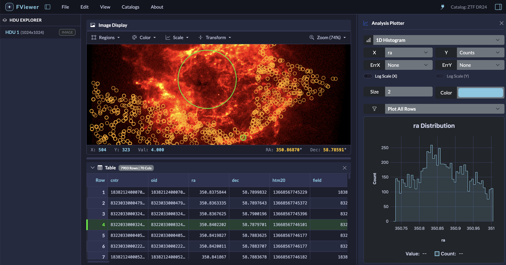

# The FViewer Workspace

FViewer is designed to feel like a modern, dark-themed desktop application right in your browser.
It keeps your tools organized and your screen uncluttered, so the focus remains entirely on your data. 

Here is a quick tour of the main workspace and how to use it.

## 1. The General Layout
When you open a file, the screen is divided into a few key areas:

-   **The Top Menubar:** Your main controls for opening files, changing view settings, header editing, saving files, and searching catalogs.
-   **The Left Sidebar (HDU Explorer):** Shows the contents of your current file.
-   **The Center Workspace:** The main area where your images and tables are displayed.
-   **The Right Sidebar (Plotter):** A collapsible panel for making quick graphs of your data.

## 2. Navigating FITS Files (The Left Sidebar)
A single FITS file often contains multiple pieces of data—such as a primary image, other images, data tables—all bundled together. These are called **HDUs** (Header Data Units). 

- When you load a file, the **Left Sidebar** lists every HDU inside it. 
- Click on an **Image HDU** to load the image to the center workspace.
- Click on a **Table HDU** (or a Binary Table) to view the table data.

## 3. The Center Workspace: Images
When viewing an image, FViewer uses your computer's graphics hardware to keep things fast and smooth, even for large files.

-   **Moving Around:** Click and drag to pan across the image. Use your mouse wheel or trackpad to zoom in and out.
-   **Adjusting Colors:** Astronomical images often contain faint details hidden in the dark background. Use the menubar tools to change the **Colormap** (e.g., Gray, Heat, Plasma) and the **Stretch** (Linear, Log, Sqrt, Asinh) to reveal these details.
-   **Coordinates (WCS):** As you move your mouse over the image, look at the bottom status bar. If your FITS file has coordinate information, FViewer will display the Right Ascension (RA) and Declination (Dec) of your cursor in real-time.
-   **Data Cubes:** If you open a multi-dimensional image (like a data cube with multiple color bands or velocity slices), a slider will automatically appear, allowing you to scrub through the different layers.

## 4. The Center Workspace: Tables
If you select a table HDU, or load a catalog (like a VOTable), it opens in the center workspace.

*   **Massive Catalogs:** You can smoothly scroll through catalogs with hundreds of thousands of rows. The viewer only loads what you are looking at, so your browser won't freeze.
*   **Nested Arrays:** Sometimes, a single cell in a FITS table contains an entire list of numbers (an array or vector). Instead of cluttering the screen with a massive wall of text, FViewer displays an interactive button in that cell. Click it to open a quick popup window where you can scroll through and inspect the nested data.

!!! tip
    If you are not seeing the 'Catalogs' menu, it generally means you are using the static (browser-only) FViewer version.
    Install the full version using `pip` to be able to use all features.

## 5. Split-Screen and Linking
If you are working with both an image and a catalog at the same time (for example, comparing an observation to a known catalog of sources), FViewer will automatically split the center workspace down the middle to show both.

These views are **linked**. 

*   If you click a source on the image, the table will instantly jump to the corresponding row and highlight it. 
*   If you click a row in the table, the image will center on that specific object.

## 6. Plotting (The Right Sidebar)
Sometimes you need to visualize the data in a table—like plotting two columns of the table.

Click the **Plot** icon in the top right corner to open the Right Sidebar. 

*   You can create 1D Histograms and 2D Scatter plots directly from your table columns.
*   The plotting engine is highly optimized; it can instantly plot thousands of points without slowing down your computer.
*   You can also filter the rows to plot only a subset. Choose either row range or a random sample.
*   You can also select a region in the image mode and plot a histogram of the counts from the image.
